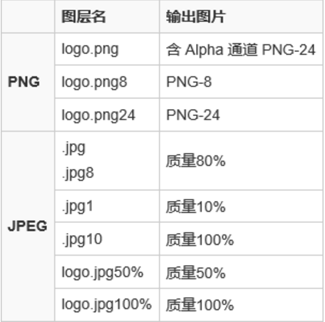

# PhotoShop切图

## 什么是切图？

设计师设计好UI后，前端进行I还原。这时候人家就给你一个psd文件了，作为前端的你就要把页面中需要的图标、按钮等图片切下来写代码。

## 切图的重要性。

前端会切图，可以说是事半功倍，不用苦涩涩的等人家切好给你。

## 切图方法。

Photoshop打开psd文件，有很多图层显示出来了，基本上保存图层就可以取到你想要的图片的总集了。

### 1. 导出psd文件中的全部图层

`文件`->`导出`->`导出图层至文件中`,选择导出格式为PNG24，最后一栏下面都选上勾。

#### 缺点：

因为并不是所有图层中的内容都是前端UI需要的，只有部分图标啊，按钮啊需要而已，所以当文件图层很多时候，要花费很多时间，效率很低。

### 2.导出psd文件中需要的图层

找到相应的图层，然后进行如下三步。

2.1 `编辑`=》 `首选项` =》 `增效工具`，勾上`生成器`，按`确定`按钮保存设置后重启photoshop。

2.2 `文件`->`生成`，勾上`图像资源`。（如果不勾上，下面导出的文件就是不是所有图层的图片了）。

**选择工具栏中的`移动`项，勾选上`单击自动获取图层和组`，就可以方便定位图层了。有时候吧，你还需要`合并图层`，选择两个图层，右键->`合并图层`。**

2.3 给某个图层/组改名，如给一个名叫"items"的组改名为"items.png"，然后就会发现在psd的目录下，多了一个“psd文件名-assets”的目录，打开就能发现已经生成好了的`items.png`文件，非常方便。

命名规则有：

2.3.1. 除上表外，还可以控制图片的尺寸，比如说要生成Retina用的图片，可以在文件名开头加上“200% ”，比如说："200% items.png"，就可以生成长宽都是原图片两倍的图片了。但是要注意的是，如果要生成不同尺寸的图片，需要在每次生成好图片后稍微改下图片文件名，这样可以避免在下次生成图片时老图片被新图片替换了的窘境。

2.3.2. 这个方法其实也是可以生成svg文件的，不过首先你的photoshop得支持svg格式才行。

参考文献：

https://segmentfault.com/a/1190000004085170

https://github.com/xiangpaopao/blog/issues/2

https://segmentfault.com/a/1190000006947487

