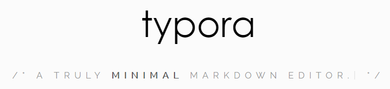

[TOC]




# Windows版本的Typora使用技巧#

## 前言##

Typora是一款轻便简洁的Markdown编辑器，支持即时渲染技术，这也是与其他Markdown编辑器最显著的区别。即时渲染使得你写Markdown就想是写Word文档一样流畅自如，不像其他编辑器的有编辑栏和显示栏。

其他优点也有很多，比如你可以使用右键给文字加上链接，或者插入一个表格等，右键你会发现有很多方法，你可以立马试试。

本文将以自己 ***写MD文件经常会遇到的问题***  为基本出发点编写。

> Markdown的详细的基本语法不做介绍，如需了解请看另一篇文章[稍后加上]()。

### 1.如何显示文章大纲目录？###

```
方法：[toc]
有些编辑器不支持，github上不支持。CSDN上支持。
```

前提：你的文章按照H1-H6这种大纲书写。

作用：用来生成文章的大纲目录

位置：哪里都可以，不一定放在最前面。[本文讨论的typora的版本:0.9.23(beta)]

例子：就如同本文前面那样。

### 2.如何改变已写文字的样式？###

问题场景：本来要写三级标题，结果多写了一个#，变成四级标题怎么办？

问题分析：如果你去掉#（或者重新加上#），你发现很别扭。

方法：

- 方法一：使用鼠标右键

  选择文字，右键，选择Paragraph，选择Heading 3.

- 方法二：使用快捷键

  选择文字，ctrl+3

- 方法三：使用工具栏

  选择文字，工具栏选择Paragraph，选择Heading 3.

  （就像在Word一样）

问题总结：这个问题可以延伸很多情景，比如普通文字变成链接文字、增加或减少文字的缩进等，这里你会发现：真的跟word是兄妹。

### 3.如何插入表格？###

如同“2.如何给标题降级”一样，用鼠标右键，快捷键，工具栏，你都可以找到方法，当然你也可以用最基本的语法。

### 4.能否像word一样将文字拖拽到某个位置？

抱歉，不能。至少目前我没有发现，如果你知道，请告诉我。

### 5.如何让插入图片变得轻松些？###

文字支持粘贴复制图片，图片支持拖拽，但是不支持粘贴复制。（MacOS支持）

问题场景：如果你的文章不单单是本地存储，自己留着看，如果你还要发布到别的地方（比如发个博客)，那你就会发现，图片路径这个是多么棘手的东西。

图片路径可以用绝对路径，也可以用相对路径，建议用相对路径。

方法：将图片与文章放在同一个文件夹下，使用相对路径表示图片。这样行吗？


