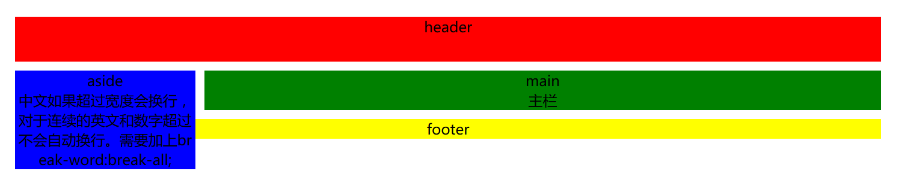

[TOC]

# 布局模型

布局模型中经典布局有：

三栏或者二栏布局中**主内容自适应宽度**且**侧栏主栏可随意换位置**，本文将针对这个需求进行分析。


> 这次布局模型将从absolute+margin-->float+margin-->圣杯布局-->双飞翼布局-->flex弹性盒子布局

需要注意的点：在此说明一下。

1. 由于搜索引擎从上到下搜索的形式，所以建议把main放到aside前面去，**主内容优先显示**。
2. 注意清除浮动

### html部分

```html
<div class="wrap">
    <header>header</header>
    <div id="content">
        <main>
            main<br>主栏
        </main>
        <aside>aside<br>中文如果超过宽度会换行，对于连续的英文和数字超过不会自动换行。需要加上break-word:break-all;</aside>
    </div>
    <footer>footer</footer>
</div>
<!--主栏写在前面，因为主栏比侧栏重要，搜索引擎是从上往下解析内容的。
中文如果超过宽度会换行，英文数字超过不会自动换行。需要加上break-word:break-all;
定义整体宽度为960px；侧栏宽度为200px;-->
```

### 1.absolute+margin

#### 方法步骤

利用相对定位实现主栏和侧栏的位置。

`aside`设置`position:absolute`，相对于父元素`#content`定位。

```css
aside{
  position:absolute;
  left:0;
  top:0;
  width:200px;
  background:green
}
```

`main`设置`margin-left/right:210px;`，为`aside`留出空间。`main`元素还是块级元素，宽度自动填充100%,自适应。

```css
main{
    margin-left:210px;
    background:green;
}
```

以上是侧栏在左情况，若侧栏在右同样可以，只需css稍微改变。

```css
aside{
  position:absolute;
  right:0;
  top:0;
  width:200px;
  background:green
}
main{
    margin-right:210px;
    background:green;
}
```

#### 严重缺点：

`absolute`脱离文档流，不影响上下文，所以无法撑起父元素`#content`的高度，如果侧栏内容多于主栏内容（侧栏高度低于主栏高度），侧栏则会溢出父元素`#content`，这个问题无法修复。如下图所示：



### 2.float+margin

#### 方法步骤

`aside`设置`float`

```css
aside{
    float:left;
    width:200px;
    background:blue;
    word-break: break-all;/*连续的英文和数字不会自动换行，此处控制自动换行*/
}
```

`main`设置`margin-left/right`，为`aside`留出空间。`main`元素还是块级元素，宽度自动填充100%,自适应。

```css
main{
    margin-left:210px;
    background:green;
}
```

敲完代码，查看结果，把aside放在右边也是一样，这并不是我们想要的，请看：


这个就是浮动换行问题，**浮动元素必须放在正常元素的前面**，所以html代码需要改。

```html
<div class="wrap">
    <header>header</header>
    <div id="content">
      <aside>aside<br>中文如果超过宽度会换行，对于连续的英文和数字超过不会自动换行。需要加上break-word:break-all;</aside>  
      <main>
           main<br>主栏
      </main>
    </div>
    <footer>footer</footer>
</div>
```

#### 缺点：

不能实现主内容优先，因为浮动元素需放前，不然会浮动换行。

### 3.圣杯布局 float+负margin

以下以循循渐进方式讲述圣杯布局。

#### 推导步骤

给`aside`和`main`都设成`float;left；` `main`宽度设成100%。

```css
main{
    float:left;
    background:green;
    width:100%;
}
aside{
    float:left;
    width:200px;
    background:blue;
}
```

这样aside和main就成为了两行显示，main独占一行。


为`aside`设置`负margin-left`!!!

`aside`设 `margin-left:-100%`会上升到main栏左侧。`margin-left:-210px；`会上升到main栏右侧。

```css
aside{
    float:left;
    width:200px;
    background:blue;
    margin-left:-100%;/*这里负margin要好好理解，-200就是上升在最右边，-100%就是上升在最左边。*/
}
```

但是你会发现侧栏挡住了主栏。


你想设置`main`的`margin`？那可不行，`main`的宽度100%，设置`margin`自己就跑出去了。

那么把`main`的父元素设置`padding`吧。

```css
#content{
    margin-bottom:10px;
    padding-left:210px;
}
```

可是你发现`aside`也跟着空出位置来了，因为他也是`#content`的子元素，不是我们想要的。


给aside设置position:relative；相对自身进行位移。

```css
aside{
    float:left;
    width:200px;
    background:blue;
    margin-left:-100%;/*这里负margin要好好理解，-200就是在最右边，-100%就是在最左边。*/
    position:relative;
    left:-210px;
}
```


把侧栏和主栏换位置也是可以的，只需改动css

```css
#content{
    margin-bottom:10px;
    padding-right:210px;
}
aside{
    margin-left:-200px;/*这里负margin要好好理解，-200px就是在最右边，-100%就是在最左边。*/
    position:relative;
    right:-210px;
}
```

#### 总结

圣杯布局可以实现主内容优先显示，也可以主栏、侧栏变位置，当然也可以防止溢出父元素。

1. main和aside全部float，aside宽度固定，main宽度自适应100%；
2. aside利用margin-left:-100%实现上升到main一栏的左侧，如果margin-left:-aside宽度 实现上升到main一栏的右侧。
3. 给父元素加（aside在左侧）padding-left:aside宽度;（aside在右侧）padding-right:aside宽度；
4. aside利用relative自身定位，相对自己移位。

### 4.双飞翼布局

双飞翼布局为了实现以上效果，多加一个标签，即给`main`包裹了一个`div`，给`div`设置`padding`，让`main`留出位置给`aside`，这样`aside`就不用自身定位了，父元素也不用`padding`了。

```html
    <div id="content">
        <main>
            <div id="inner">main<br>主栏</div>
        </main>
        <!--主栏写在前面，因为主栏比侧栏重要，搜索引擎是从上往下解析内容的。中文如果超过宽度会换行，英文数字超过不会自动换行。需要加上break-word:break-all;-->
        <aside>aside<br>中文如果超过宽度会换行，对于连续的英文和数字超过不会自动换行。需要加上break-word:break-all;</aside>
    </div>
```

css代码：

```css
#inner{
    margin-left:210px;
    background:green;
}
```

### 5.flex弹性盒子

如果你想让main和aside一样高怎么办呢？如图：


用flex弹性盒子解决。

给`main`和`asdie`父元素设`display:flex;`和`flex-flow ` 给`main`设置`flex:1`,合理分配剩余空间。

```css
#content {
    display: flex;
    flex-flow: row-reverse;/*如果是row(默认值)，则侧栏在右*/
}
main{
    flex: 1;/*按比例缩小或者放大，如果没有这一项就会是按照内容宽度显示*/
    background:green;
    margin-left:10px;
}
aside{
    width:200px;
    background:blue;
}
```

盒子满足以上所有优点，但是需要考虑兼容性问题。

[在线演示](https://vx9.github.io/practice/layout/layout.html)

[详细代码](./layout)

